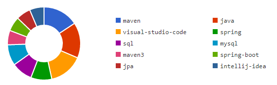
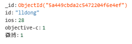

# Segmentfault爬虫与k-means算法

### 1.Question页面获取

Question页面的URL格式为`https://segmentfault.com/q/10100000XXXXXXXX`，后八位没有明显规律，因而只能从索引页获取，索引页格式为`https://segmentfault.com/questions?page=XXX`，后三位为页数，尾页为5735,可以用一个for循环组装出所有索引页：

```python
baseListPage='https://segmentfault.com/questions?page='
for i in range(1,5736):#5735
    listpage=baseListPage+str(i)
```

接下来就是从索引页获取Question页面，使用requests+re实现:

```python
def getURLlist(listpage,tmpDict,proxies=proxies):        #获取Question页面
    try:
        a=requests.get(listpage,proxies=proxies)
        a.raise_for_status
        if(not re.findall('暂时无法对非人类提供服务, 请输入以下验证码核实身份',r.text)):
            soup=bs4.BeautifulSoup(a.text,"html.parser")
            ls=soup.findAll('section',class_="stream-list__item")
            for sec in ls:
                tmp1=re.findall(r'<h2 class="title"><a href="/q/10100000.*"',str(sec))
                tmp2=re.findall(r'<span>.*</span>',str(sec))
                tmp3=str(tmp2[0])[6:-7]
                if(tmp3[-1]=='k'):
                    tmp3=float(tmp3[:-1])*1000
                tmpDict['https://segmentfault.com'+tmp1[0].split('"')[3]]=int(tmp3)
        else:
            input()      #触发验证码时暂停程序
            getURLlist(listpage,tmpDict,proxies)
    except:
        print('error2\n')
```

索引页同时提供URL和浏览数，因此每次抓取URL和浏览数用键值对存储，添加至tmpDict字典中，然后将URL按照浏览数降序排列，存储在url.txt中，全部代码如下：

```python
from myModels import *

q=Queue()        #创建队列
NUM=7			#设置线程数
URLlist=[]
tmpDict={}
baseListPage='https://segmentfault.com/questions?page='

def working():
    while(True):
        listpage=q.get()
        getURLlist(listpage,tmpDict,proxies)
        print(listpage)
        time.sleep(1)
        q.task_done()

for i in range(NUM):   #创建线程
    t=Thread(target=working)
    t.setDaemon(True)
    t.start()

for i in range(1,5736):#5735
    listpage=baseListPage+str(i)
    q.put(listpage)  #将索引页链接放入队列

q.join()

URLlist=sorted(tmpDict.items(), key=lambda x:x[1], reverse=True)  #将URL按照浏览数降序排列

with open('url.txt','w',encoding='utf-8') as f2:  #将URL存储在url.txt中
    for item in URLlist:
        f2.write(item[0]+'\n')
    f2.close()
```

### 2.Tag和用户主页URL获取

首先定义用于获取页面源代码的函数：

```python
def getHTML(url,headers=headers):       #获取HTML源代码
    try:
        print(url)
        r=requests.get(url,headers=headers)
        r.raise_for_status
        if(not re.findall('暂时无法对非人类提供服务, 请输入以下验证码核实身份',r.text)):
            return r.text
        else:
            input()                     #触发验证码时暂停程序
            r=requests.get(url,headers=headers)
            return r.text
    except:
        print('error1\n')
```

Question页面中包含用户添加的Tag和用户主页URL，使用re和bs4获取：

```python
def getTag(html):   #提取Tag
    ls=[]
    match=re.findall(r'data-original-title=".*"',html)
    if(len(match)!=1):
        for i in range(len(match)-1):
            ls.append(match[i].split('"')[1]+' ')
    return ls
```

```python
def getUserUrl(html):
    ls=[]
    soup=bs4.BeautifulSoup(html,"html.parser")
    if(re.findall(r'/u/.*"',str(soup.find(class_="question__author")))):
        ls.append('https://segmentfault.com'+re.findall(r'/u/.*"',str(soup.find(class_="question__author")))[0][:-1]+'\n')
    if(soup.findAll(class_="answer__info--author-name")):
        for txt in soup.findAll(class_="answer__info--author-name"):
            if(re.findall(r'/u/.*?"',str(txt))):
                ls.append('https://segmentfault.com'+re.findall(r'/u/.*?"',str(txt))[0][:-1]+'\n')
    return ls
```

然后将获取的Tag和用户主页URL存储于tag.txt和userUrl.txt中

```python
from myModels import *

q=Queue(10) #创建队列
NUM=3
f1=open('userUrl.txt','w',encoding='utf-8')
f2=open('tag.txt','w',encoding='utf-8')

def working():
    while(True):
        url=q.get() #从队列取值
        html=getHTML(url)
        for txt in getTag(html):
            f2.write(txt)
        for txt in getUserUrl(html):
            f1.write(txt)
        time.sleep(0.5)
        q.task_done()
        if(q.empty()):
            break

for i in range(NUM): #创建线程
    t=Thread(target=working)
    t.setDaemon(True)
    t.start()

with open('./url/url.txt','r',encoding='utf-8') as fl:
    for url in fl:
        if(url):
            q.put(url[:-1])
    q.join()
    fl.close()

f1.close()
f2.close()
```

最后用Tagxedo生成词云


### 3.用户信息抓取

用户信息集中于社区索引中，反映了用户的关注点和技术方向

eg.

同样，使用requests和re可以抓取到上述信息，以键值对的形式存储于字典中

```python
def getUserData(url,headers=headers):
    try:
        print(url)
        r=requests.get(url,headers=headers)
        r.raise_for_status
        if(not re.findall('暂时无法对非人类提供服务, 请输入以下验证码核实身份',r.text)):
            ls=re.findall(r'"name":".*?","incr":"\d*?"',r.text)
            for i in range(len(ls)):
                ls[i]=eval("'{}'".format(ls[i]))
            lsd={}
            lsd['id']=url[27:]
            for i in range(len(ls)):
                tx=re.sub(r'\.','_',ls[i].split('"')[3])
                lsd[tx]=int(ls[i].split('"')[-2])
            return lsd
        else:
            input()
            ls=re.findall(r'"name":".*?","incr":"\d*?"',r.text)
            for i in range(len(ls)):
                ls[i]=eval("'{}'".format(ls[i]))
            lsd={}
            lsd['id']=url[27:]
            for i in range(len(ls)):
                tx=re.sub(r'\.','_',ls[i].split('"')[3])
                lsd[tx]=int(ls[i].split('"')[-2])
            return lsd
    except:
        print('error3\n')
```

用字符串形式存储字典不便读取，因此将用户信息存储于MongoDB数据库中

```python
from myModels import *

q=Queue(10)
NUM=3

col=pymongo.MongoClient().userData.data

def working():
    while(True):
        url=q.get()
        col.insert(getUserData(url))
        time.sleep(0.5)
        q.task_done()
        if(q.empty()):
            break


for i in range(NUM):
    t=Thread(target=working)
    t.setDaemon(True)
    t.start()

with open('userUrl.txt','r',encoding='utf-8') as fl:
    ls=list(set(list(fl)))
    for url in ls:
        if(url):
            q.put(url[:-1])
    q.join()
    fl.close()
```

### 4.k-means数据分析

之前抓取到的用户信息存储形式如下



部分用户没有任何信息，表现为无tag或tag后值为0，无法用于聚类分析，因此删去

```python
for dic in col.find():
    m=0
    for key in dic:
        if(isinstance(dic[key],int)):
            m=m+dic[key]
    if(m==0):
        col.delete_one({'_id':dic['_id']})
```

首先要去除不需要的mongoDB索引`'_id':XXX`，然后将各个标签的值转化为所占百分比

```python
for dic in ls:
    m=0
    for key in dic:
        if(isinstance(dic[key],int)):
            m+=dic[key]
    for key in dic:
        if(isinstance(dic[key],int)):
            dic[key]=round(float(dic[key])/float(m),4)
    del dic['_id']
```

然后要确定样本特征数，与生成词云类似，我们先收集所用用户标签，然后统计词频，取其前100作为特征值，再将用户数据补充/删除至100个，对应值组成100*用户数的矩阵作为数据输入，使用k-means进行聚类分析

获取前100的tag：

```python
wd=[]
for dic in ls:
        for key in dic:
            wd.append(key)

count=collections.Counter(wd)
wd=[]
ct=0
for x in count:
    if(x!='id'):
        wd.append(x)
    ct+=1
    if(ct==101):
        break
```

用户数据处理：

```python
userdata={}    	#添加用户id的数据集
dataSet=[]		#用于k_means聚类的数据集
for dic in ls:
    tmp=[]
    for tag in wd:
        tmp.append(tag)
    for i in range(100):
        for key in dic:
            if(key==tmp[i]):
                tmp[i]=dic[key]
    for i in range(100):
        if(isinstance(tmp[i],str)):
            tmp[i]=0
    dataSet.append(tmp)
    userdata[dic['id']]=tmp
```

注意到部分用户的tag中没有包含在前100的tag中，无法使用，因此去除：

```python
for x in reversed(range(len(dataSet))):
    if(not sum(dataSet[x])):
        del dataSet[x]
t=list(userdata.keys())
for x in t:
    if (not sum(userdata[x])):
        del userdata[x]
```

k_means部分：

```python
from numpy import *

def distEclud(vecA, vecB):
    return sqrt(sum(power(vecA - vecB, 2)))

def core(dataSet, k, centroids ,distMeas=distEclud, createCent=randCent):
    m = shape(dataSet)[0]  #m为样本数
    clusterAssment = mat(zeros((m,2)))
    clusterChanged = True
    while clusterChanged:
        clusterChanged = False
        for i in range(m):
            minDist = inf               #minDist为正无穷
            minIndex = -1
            for j in range(k):
                distJI = distMeas(centroids[j,:],dataSet[i,:])
                if distJI < minDist:
                    minDist = distJI; minIndex = j
            if clusterAssment[i,0] != minIndex: 
                clusterChanged = True
            clusterAssment[i,:] = minIndex,minDist**2
        print(centroids)
        for cent in range(k):#重定位中心点
            ptsInClust = dataSet[nonzero(clusterAssment[:,0].A==cent)[0]]
            centroids[cent,:] = mean(ptsInClust, axis=0)
    return centroids, clusterAssment

def kMeans(dataSet,k,centroids):
    myCentroids, clustAssing= core(dataSet,k,centroids)
    myCentroids[isnan(myCentroids)]=0
    return myCentroids
```

原本采用随机的中心点，但效果不佳，出现大量中心点收敛到原点的问题，因此从数据集选取前k个样本作为中心点起始数据。

```python
centroids=[]
for x in range(20):
    centroids.append(dataSet[x])
```

最后使用收敛后的中心点对原始数据进行聚类：

```python
fl=[]
for x in range(20):
    fl.append(open('sort2/'+str(x)+'.txt','w',encoding='utf-8'))
for x in userdata:
    num=0
    distance=k_means.distEclud(centroids[0],userdata[x])
    for i in range(1,20):
        if(k_means.distEclud(centroids[i],userdata[x])<distance):
            distance=k_means.distEclud(centroids[i],userdata[x])
            num=i
    fl[num].write(x+'\n')
for x in range(20):
    fl[x].close()
```

检验后发现得到的20个类与编程语言的关系不明显，因此尝试手动挑出前100tag中与编程语言较为相关的tag做成新的taglist，再重复上述过程：

```python
wd=[['javascript','html','css','react_js','jquery','node_js'],
    ['c','c++','mfc'],
    'php',
    ['java','android','jdk8','java-ee'],
    ['python','python3_x','python2_7','pywin32'],
    ['ios','objective-c'],
    ['swift','ios7'],
    ['c#','unity','unity2d'],
    'golang']
```

因为列表中有列表元素，因此tag替换为值得过程改为这样：

```python
for dic in ls:
    tmp=[]
    for tag in wd:
        tmp.append(tag)
    for i in range(len(wd)):
        if(not isinstance(tmp[i],list)):
            for key in dic:
                if(key==tmp[i]):
                    tmp[i]=dic[key]
        else:
            n=0.0
            for x in range(len(tmp[i])):
                for key in dic:
                    if(key==tmp[i][x]):
                        n+=dic[key]
            tmp[i]=n
```

文件说明：

1.文件夹：

`sort2`:原始方案聚类结果

`sort`:改进方案聚类结果

`url`:抓到的Question页面链接

2.文件

`getFaqUrl.py`:获取Question页面

`getTag&UserUrl.py`:获取tag和用户主页

`getUserData.py`:获取用户信息

`k_means.py`:k-means聚类算法

`myModels.py`:存储各种自定函数

`process.py`:由前100的tag取20个中心点聚类

`process_v2,py`:有挑选tag取9个中心点聚类

`tag.txt`:存储抓到的tag

`userUrl.py`:存储抓到的用户主页

`mongodb.7z`:存储用户信息的数据库

PS：由于网络原因，抓取数据不完整

